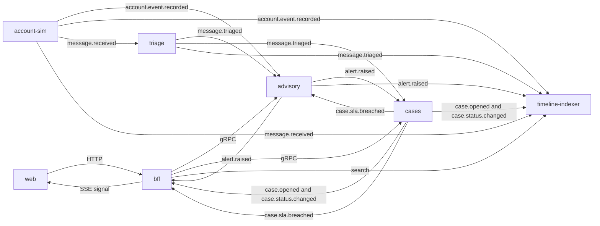
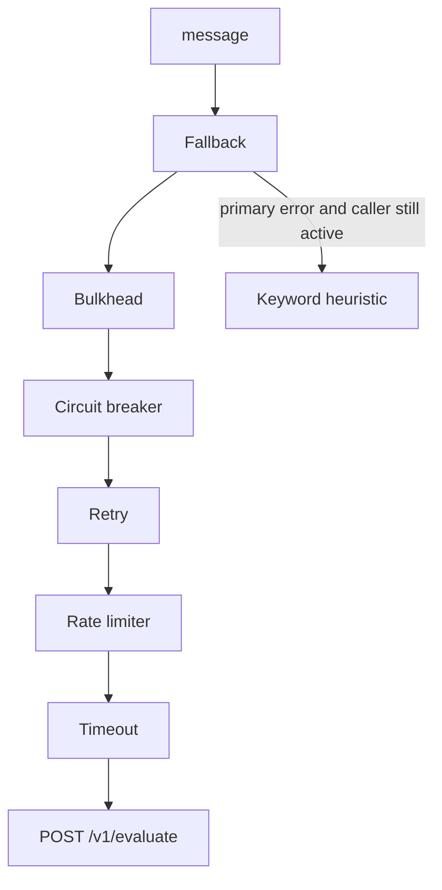
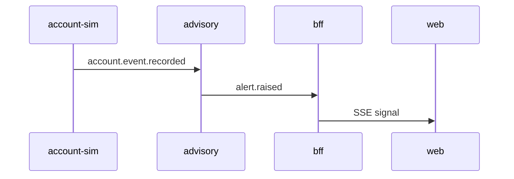

# Architecture diagrams

## Runtime

The BFF is the only process the browser calls. It stores nothing. Opening a case from an alert is the async path `alert.raised` → `cases` → `case.opened`, not a gRPC write.

## Triage call

One message is one breaker result. Each HTTP attempt takes one rate-limit token and its own timeout.

## Demo trace

The same trace id is on the RabbitMQ headers and on the SSE event.
