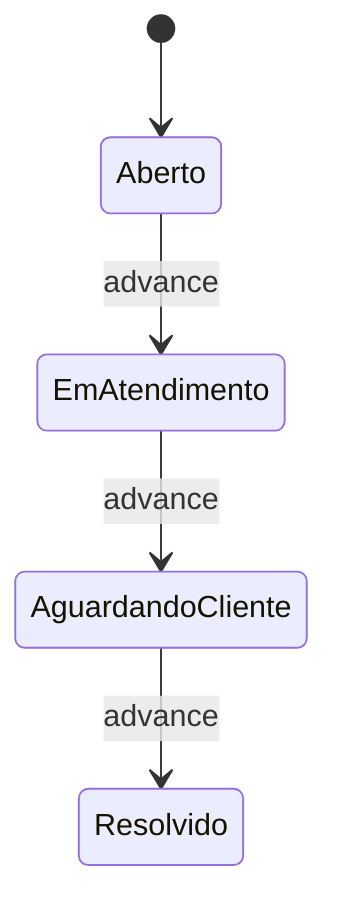
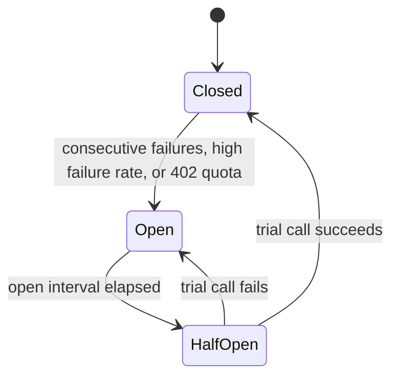

# State machines

## Case

Forward only. The prototype does not define a backward transition. Escalation is a flag on the case, not a fifth state. Desktop "Abrir caso" lands the card in Aberto and does not open the detail.

Each advance emits `case.status.changed`. The first open emits `case.opened`. Both are consumed by the BFF and the timeline indexer.

## SLA clock

Base minutes: Essencial 1440, Advance 240, Singular 60. Halve that total when any of these is true: churn risk, frustration at Frustrado or Muito frustrado, human requested, relevant withdrawal. The seed uses the halved clock: an Advance complaint is 120 minutes, a Singular investment question with none of those flags stays 60.

| Display | When |
|---|---|
| No prazo | Remaining is at least the due threshold |
| Vencendo | Remaining is below `max(33% of total, 20 minutes)` and still positive |
| Vencido | Remaining is zero or less |

Expiry is a message TTL. The dead-letter exchange delivers `case.sla.breached` to the BFF and to advisory. No cron. Advisory records the escalation; the case keeps its current state and gains the escalated flag. The demo must be able to let one SLA hit zero and show that flag.

## Circuit breaker

Open after 3 consecutive message-level failures, or when 5 of the last 10 outcomes failed, or on `402 quota_for_entity_exceeded`. The open interval is 15 seconds. Half-open sends one trial.

Open means the heuristic runs immediately and the advisor does not wait. `400 invalid_request` does not move the breaker. A caller-canceled context does not fall back and does not count as a provider failure.
