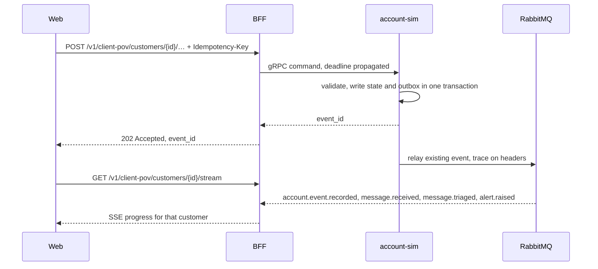
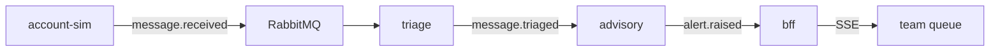
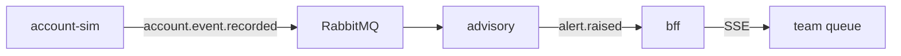

# Architecture diagrams

The visitor-facing walkthrough copy is in `ux.md`. These diagrams are the command and the fan-out. The complaint call is `POST /v1/client-pov/customers/{id}/complaints`.

## Accepted client action

A withdrawal above available cash stops inside account-sim. No outbox row, no `202`. The BFF returns `422`.

A second POST with the same `Idempotency-Key` returns the first result and does not publish again.

## After the 202

No new event name. Who consumes each event stays the phase-1 list in the adopted architecture. These are the two demo paths.

A complaint or free message takes that path. cases and timeline-indexer also receive `message.triaged`, as in phase 1.

A deposit or withdrawal takes that path and updates `book.aum` and `book.segment`. timeline-indexer receives `account.event.recorded` as well. An action that no rule turns into an alert still reaches the timeline.
