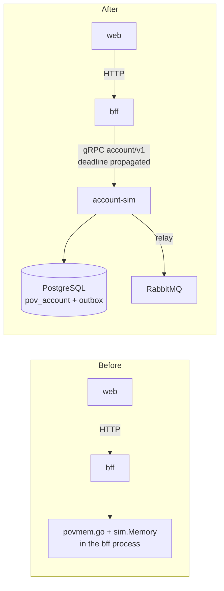
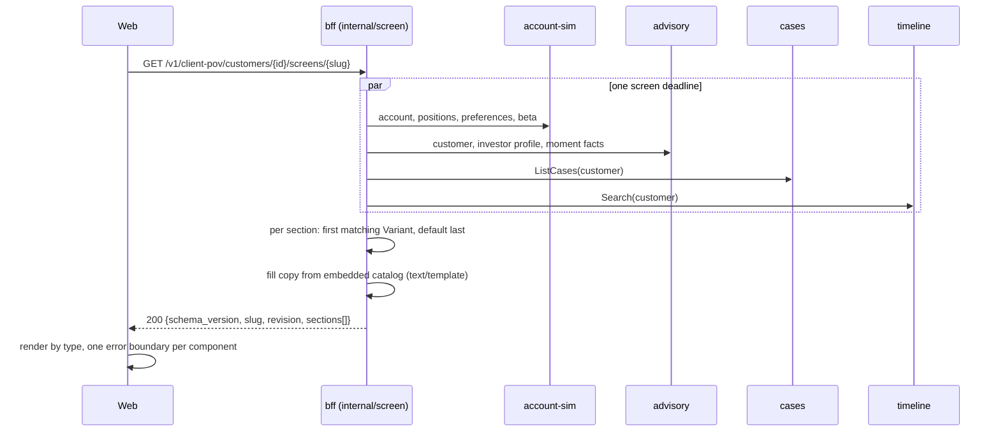
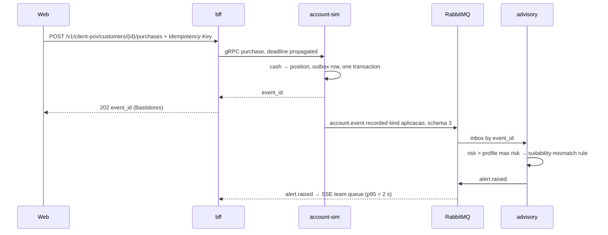

# Architecture diagrams

Phase-3 flows. The phase-2 command and fan-out diagrams stay in the adopted `../spec-client-pov/architecture-diagrams.md`.

## Phase A: before and after



## Screen build



If a source fails or times out, its sections fall back to the default variant or are omitted. The response is still `200`.

## Purchase above profile



## Advance one market day

```mermaid
sequenceDiagram
  participant Web
  participant BFF as bff
  participant Acct as account-sim
  participant RMQ as RabbitMQ
  participant Adv as advisory
  Web->>BFF: POST /v1/client-pov/simulation/advance-day + Idempotency-Key
  BFF->>Acct: gRPC advance day (global rate limit in bff)
  Acct->>Acct: one transaction: sim_day+1, revalue every account,<br/>one reavaliacao outbox row per account<br/>key reavaliacao:{customer_id}:{sim_day}
  Acct-->>BFF: new sim_day
  BFF-->>Web: 202
  Acct->>RMQ: account.event.recorded kind reavaliacao × accounts
  RMQ->>Adv: book follows patrimony; drop rule on loss > 15%
  Adv->>RMQ: alert.raised (Mariana on the shock day)
```

On the next home load, advisory's moment facts carry the drop and the BFF serves `portfolio_drop`.
